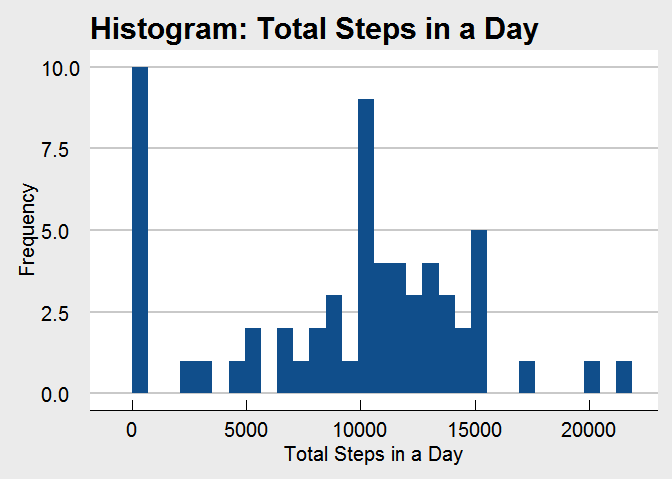
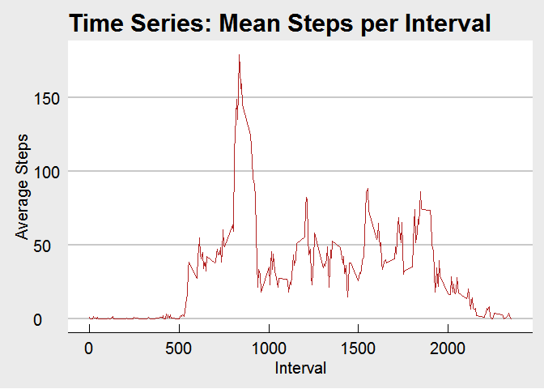
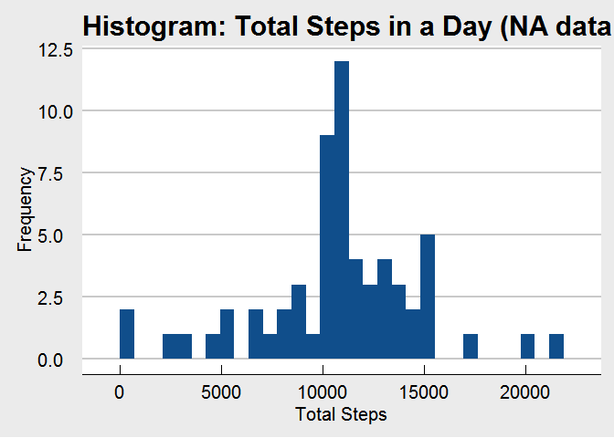
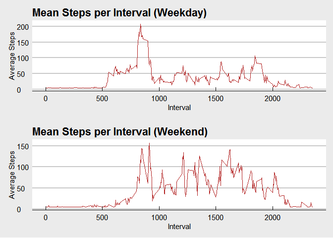

# Reproducible Research: Peer Assessment 1

## Loading and preprocessing the data

```r
ActivityData <- read.csv('activity.csv', header = TRUE, sep=",")
```

## What is mean total number of steps taken per day?

```r
suppressMessages(library(dplyr))
library(ggplot2)
library(ggthemes)
ActivityData$date <- as.Date(ActivityData$date)
ActivityData$steps <- as.numeric(ActivityData$steps)
ActivityDataTS <- ActivityData %>%
    mutate(steps = ifelse(is.na(steps),0,steps)) %>%
    group_by(date) %>%
    summarize(TotalSteps = sum(steps))

ggplot(data=ActivityDataTS, aes(ActivityDataTS$TotalSteps)) +
    geom_histogram(fill = "dodgerblue4") +
    ylab("Frequency") + xlab("Total Steps in a Day") +
    ggtitle("Histogram: Total Steps in a Day") +
    theme_economist_white(base_size = 15, base_family = "sans")
```

```
## `stat_bin()` using `bins = 30`. Pick better value with `binwidth`.
```



```r
summary(ActivityDataTS$TotalSteps)
```

```
##    Min. 1st Qu.  Median    Mean 3rd Qu.    Max. 
##       0    6778   10400    9354   12810   21190
```

## What is the average daily activity pattern?

```r
ActivityDataMS <- ActivityData %>%
                mutate(steps = ifelse(is.na(steps),0,steps)) %>%    
                group_by(interval) %>%
                summarize(MeanSteps = mean(steps))

ActivityDataMS %>%
    ggplot(aes(interval,MeanSteps)) + geom_line(color="firebrick") +
    ylab("Average Steps") + xlab("Interval") +
    ggtitle("Time Series: Mean Steps per Interval") +
    theme_economist_white(base_size = 15, base_family = "sans")
```



On average across all the days in the dataset, what 5-minute interval contains
the maximum number of steps?

```r
ActivityDataMS$interval[which.max(ActivityDataMS$MeanSteps)]
```

```
## [1] 835
```

## Imputing missing values

There are many days/intervals where there are missing values (coded as `NA`). The presence of missing days may introduce bias into some calculations or summaries of the data.


```r
sum(is.na(ActivityData))
```

```
## [1] 2304
```

All of the missing values are filled in with mean value for that 5 interval across all days.


```r
# Replace each missing value with the mean value of its 5-minute interval
newActivityData <- ActivityData
newActivityData$steps[is.na(newActivityData$steps)] <- mean(newActivityData$steps, na.rm = T)
```
Make a histogram of the total number of steps taken each day and calculate the mean and median total number of steps.


```r
newActivityDataTS <- newActivityData %>%   
                group_by(date) %>%
                summarize(TotalSteps = sum(steps))

ggplot(data=newActivityDataTS, aes(newActivityDataTS$TotalSteps)) +
    geom_histogram(fill = "dodgerblue4") +
    ylab("Frequency") + xlab("Total Steps") +
    ggtitle("Histogram: Total Steps in a Day (NA data replaced)") +
    theme_economist_white(base_size = 15, base_family = "sans")
```

```
## `stat_bin()` using `bins = 30`. Pick better value with `binwidth`.
```



The Mean and median values are higher after imputing missing data since there are no longer days with `NA` values, which are effectively zero.  Below you will see the summary statistics for the data set with imputed values. 


```r
summary(newActivityDataTS$TotalSteps)
```

```
##    Min. 1st Qu.  Median    Mean 3rd Qu.    Max. 
##      41    9819   10770   10770   12810   21190
```


## Are there differences in activity patterns between weekdays and weekends?
Use the 'weekdays' function to determine whether a date is on a weekend or a weekday.


```r
newActivityData$weekdays <- weekdays(newActivityData$date)
newActivityData$daytype[(newActivityData$weekdays == "Saturday" | newActivityData$weekdays == "Sunday")] <- "weekend"
newActivityData$daytype[!(newActivityData$weekdays == "Saturday" | newActivityData$weekdays == "Sunday")] <- "weekday"
```

Next, create plots for the weekday and weekend means by date, and use the grid and gridExtra libraries to combine the plots in a single panel.

```r
library(grid)
library(gridExtra)

WeekDataMS <- newActivityData %>%
    group_by(interval,daytype) %>%
    summarize(MeanSteps = mean(steps))

WeekdayData <- filter(WeekDataMS, daytype == "weekday")
WeekendData <- filter(WeekDataMS, daytype == "weekend") 

weekdayGraph <- WeekdayData %>%
    ggplot(aes(interval,MeanSteps)) + geom_line(color="firebrick") +
    ylab("Average Steps") + xlab("Interval") +
    ggtitle("Mean Steps per Interval (Weekday)") +
    theme_economist_white(base_size = 11, base_family = "sans")

weekendGraph <- WeekendData %>%
    ggplot(aes(interval,MeanSteps)) + geom_line(color="firebrick") +
    ylab("Average Steps") + xlab("Interval") +
    ggtitle("Mean Steps per Interval (Weekend)") +
    theme_economist_white(base_size = 11, base_family = "sans")

grid.arrange(weekdayGraph, weekendGraph, ncol = 1)
```


